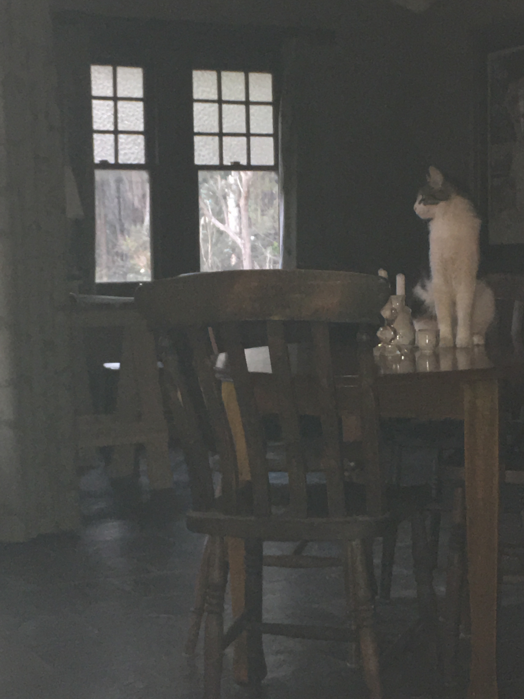

```{r setup, include=FALSE}
options(htmltools.dir.version = FALSE)
```




---
# She's the cats' mother


---

class: bottom, right

background-image: url(https://upload.wikimedia.org/wikipedia/commons/3/30/Euklid-von-Alexandria_1.jpg)

Image credit: [Wikimedia Commons](https://commons.wikimedia.org/wiki/File:Sharingan_triple.svg)


---
class: bottom, right

background-image: url(https://upload.wikimedia.org/wikipedia/commons/8/8a/CICB%27s_Laboratory.jpg)

Image credit: [Wikimedia Commons](https://commons.wikimedia.org/w/index.php?curid=21915714)


---
class: middle, right

background-image: url(https://upload.wikimedia.org/wikipedia/commons/5/50/OpenOffice.org_Calc.png)

Image credit: [Wikimedia Commons](https://commons.wikimedia.org/w/index.php?curid=4286371)

---
class: top, right

background-image: url(https://upload.wikimedia.org/wikipedia/en/2/21/Web_of_Spider-Man_Vol_1_129-1.png)

Image credit: [Wikimedia Commons](https://en.wikipedia.org/w/index.php?curid=58461384)

# with great power comes great responsibility

---
class: bottom, right

background-image: url(http://unconf18.ropensci.org/images/Seattle.svg)

Image credit: [rOpenSci](http://unconf18.ropensci.org/)

# `l33t` is in the eye of the beholder


---
class: middle, centre

# `varameta`

For meta-analysing medians.

---
class: inverse
#### Thanks for listening! How to bling your slides, r-ladies style: 

```{r eval=FALSE, echo = TRUE}
output:
  xaringan::moon_reader:
    css: ["default", "rladies", "rladies-fonts"]
```

```{r echo = TRUE}
knitr::include_url("https://alison.rbind.io/post/r-ladies-slides/", height = 375)
``` 

